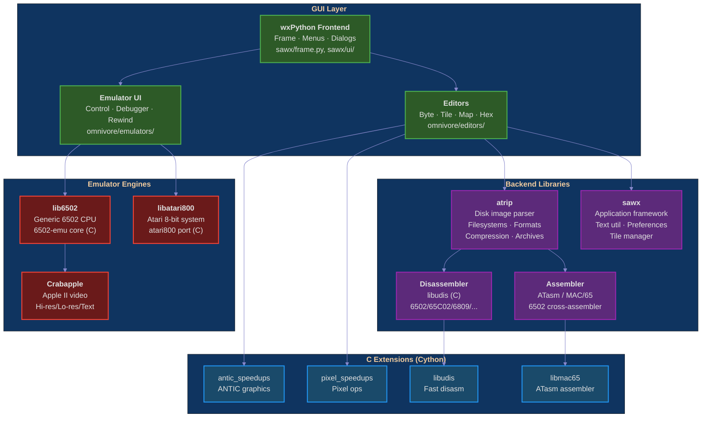

# Omnivore 2.0 — The Retrocomputing Reverse Engineering Toolbox



## Abstract

Omnivore - the retrocomputing reverse engineering toolbox

Omnivore is a cross-platform app for modern hardware (running linux, MacOS and
Windows) to work with executables or media images of Atari 8-bit, Apple ][+,
and other retrocomputer machines and game consoles.

Features include:

* emulator with debugger (see below)
* binary editor
* disassembler (6502, 65C02, 6809, and many other 8-bit CPU architectures)
* 6502 cross-assembler (ATasm, uses MAC/65 syntax)
* graphics editor
* map editor
* Jumpman level editor (Atari 8-bit platform only)
* disk image browser and manipulator (via atrip)

## Emulator

Omnivore provides a unified front-end to several 8-bit CPU and system emulators
to provide a common set of control methods for both normal operation and
debugging purposes.

Currently available are:

* **libatari800**, an embedded port of the [atari800 emulator](https://atari800.github.io/)
* **lib6502**, a generic 6502 emulator based on [David Buchanan's 6502-emu](https://github.com/DavidBuchanan314/6502-emu)
* **crabapple**, a thin layer atop lib6502 that provides Apple ][+ video emulation (hi-res, lo-res, text modes, soft-switches)

The debugger includes:

* rewind capability to return to previous point of emulation
* debugger able to step forward (**and**, soon, backward)
* change any portion of memory or processor state
* CPU instruction history browser
* memory access visualizer
* memory map labels, used for disassembler
* customizable memory viewer using labels and data types

## A Tribute

While producing the Player/Missile podcast, I have had many ideas about hacking
code on the 8-bits like I used to as a kid. One of the tools I had was the
Omnimon system monitor board by CDY Consulting, an add-on board for the Atari
800 that provided a ROM-resident monitor similar to what was provided in the Apple ][+ hardware.  In fact, I originally named this program Omnimon but felt
that would be too confusing as there are people in the 8-bit community who
still use the original Omnimon hardware.  Using the prefix "Omni-" is my
tribute to all the fun I had with the Omnimon hardware.

## How To Run Omnivore

Omnivore 2.0 is still under heavy development. When it gets to a more stable
state, I will create binaries for Windows and MacOS. These instructions will be
for that time.

### Windows & MacOS

Binaries are available for Windows 7 and later (64-bit
only) and Mac OS X 10.9 and later and at the [home page](http://playermissile.com/omnivore/)
or directly through the [github releases](https://github.com/robmcmullen/omnivore/releases) page.

### Linux (or Using a Virtual Environment)

Binaries for linux are not currently available, although I would like to
provide packages for Ubuntu, Linux Mint and Gentoo at some point.

To run on linux, you'll have to have a Python 3.6+ environment set up. How to do
this will depend on your distribution, but there's a good chance that if it is
not installed already, your package manager will be able to install it for you.

I'd recommend using a virtual environment so you don't clutter up the system
python, but if you're willing to risk it, the virtualenv step is optional:

```
python -m venv /some/path/to/your/virtualenv
source /some/path/to/your/virtualenv/bin/activate
```

Then, install with:

```
pip install omnivore
```

On some distributions, you will need development libraries to install wxPython
4 because pip needs to compile it from source. On Ubuntu this is:

```
sudo apt-get install libgstreamer1.0-dev libgtk-3-dev
```

The webkit2gtk package name depends on your Ubuntu version:

* **Ubuntu 22.04 LTS (Jammy) and older**:
  ```
  sudo apt install libwebkit2gtk-4.0-dev
  ```
* **Ubuntu 24.04 LTS (Noble) and newer**:
  ```
  sudo apt install libwebkit2gtk-4.1-dev
  ```

Linux Mint does not have a C++ compiler installed by default, so additional
packages are needed:

```
sudo apt install g++ python3-dev
```

And on Gentoo this is:

```
emerge -av net-libs/webkit-gtk
```

**Note for arm64/aarch64:** wxPython does not provide pre-built wheels for
Linux arm64. You may need to build wxPython from source (requires the
development packages listed above) or install the system wxPython package
(`python3-wxgtk4.0`) if available for your distribution.

## Installing From Source

If you're interested in hacking on the code or making bug fixes or
improvements, you can install and run the source distribution.

### Prerequisites

* Python 3.8 and above (3.6+ may work but is EOL), capable of building C extensions
* git
* C compiler (gcc/clang)
* Cython (for building C extensions from .pyx files)

Note: Python 2 is not supported.

Your version of python must be able to build C extensions, which should be
automatic in most linux and on OS X. You may have to install the python
development packages on linux distributions like Ubuntu or Linux Mint.

Windows doesn't come with a C compiler, but happily, Microsoft provides a
cut-down version of their Visual Studio compiler just for compiling Python
extensions! Download and install it from
[here](https://www.microsoft.com/en-us/download/details.aspx?id=44266).

### System Dependencies (Linux)

On Ubuntu/Debian, install the required development packages:

```
sudo apt install build-essential python3-dev git
sudo apt install libgstreamer1.0-dev libgstreamer-plugins-base1.0-dev libgtk-3-dev
# Ubuntu 22.04 LTS and older:
sudo apt install libwebkit2gtk-4.0-dev
# Ubuntu 24.04 LTS and newer:
sudo apt install libwebkit2gtk-4.1-dev
```

### Dependency Checker

Before building, run the dependency checker to identify any missing
requirements:

```
python scripts/check_deps
```

This will check for the correct Python version, system packages, Python
packages, git submodule status, and pre-built C extensions.

### Virtualenv Setup

I'd recommend using a different virtualenv than the one used above because it's possible that python packages that the git source depends on may be at different versions than the current published version:

```
python -m venv /some/path/to/your/development/virtualenv
source /some/path/to/your/development/virtualenv/bin/activate
```

Get the source from cloning it from github:

```
$ git clone https://github.com/robmcmullen/omnivore.git
$ cd omnivore
$ git submodule init
$ git submodule update
```

Install all Python dependencies:

```
pip install numpy cython python-slugify ply lz4 'construct<2.9' pytz 'pyparsing<3.0' configobj bson jsonpickle pyopengl appdirs pillow six pathlib2 wxpython
```

Build the C extensions (Cython modules and emulator code):

```
$ python setup.py build_ext --inplace
```

If the build succeeds, you should see `.so` files in the `omnivore/arch/`,
`omnivore/emulators/`, `atrip/disassemblers/`, and
`atrip/assemblers/` directories.

**Note:** The `setup.py` file now automatically detects the numpy include path
instead of using a hardcoded path, so it should work on any Linux distribution
out of the box.

### Running the Program

Once the C modules are built, you can run the program from the main source
directory using:

```
$ python run.py
```

Or use the installed script (if installed via pip):

```
$ omnivore
```

If you only need the command-line disk image tools (without the GUI):

```
$ python -m atrip [args]
```

Or via the bundled script:

```
$ python scripts/atrip [args]
```

## Development

### Graphics Speedups

Cython extensions speed up time-critical code (repainting character graphics,
ANTIC display generation, pixel format conversion). Cython is only needed if
you modify the `.pyx` files; pre-built `.so` files are included for
aarch64 Linux.

Recent improvements (2024-2025):

* **NumPy 2.x compatibility**: explicit `dtype` in `np.arange` calls,
  explicit `int()` casts for numpy scalar types throughout atrip
* **Python 3.12 support**: regex raw strings, integer division fixes,
  `None`-safe editor/viewer guards
* **Dependency checker**: `scripts/check_deps` validates your build
  environment before you start
* **wxWidgets robustness**: size clamping to prevent negative-dimension
  warnings in tile manager layout

Should you change a cython file (e.g. `omnivore/arch/antic_speedups.pyx`),
use the command `python setup-cython.py` to turn that into a C extension,
then use `python setup.py build_ext --inplace` to regenerate the dynamic
libraries.

### Plugins

Omnivore will be able to be extended using plugins based on the
[Enthought Framework](http://docs.enthought.com/envisage/envisage_core_documentation/index.html)
which are discovered automatically at runtime using setuptools plugins.

The plugin architecture is documented by Enthought, but is not terribly easy to
understand.  I intend to produce some sample plugins to provide some examples
in case others would like to provide more functionality to Omnivore.

## Usage

In addition to the Omnivore program itself, this module can be used in other
projects. For example, Omnivore supplies a python front-end to the cross
assembler ATasm, meaning you can compile 6502 code right from your python
program.

### ATasm Example

From the ATasm readme:

> ATasm is a 6502 command-line cross-assembler that is compatible with the
> original Mac/65 macroassembler released by OSS software.  Code
> development can now be performed using "modern" editors and compiles
> with lightning speed.

A simple example:

```python
#!/usr/bin/env python

from omnivore.assembler import find_assembler

assembler_cls = find_assembler("atasm")
assembler = assembler_cls()

asm = assembler.assemble("libatasm/atasm/tests/works.m65")

if asm:
    print(asm.segments)
    print(asm.equates)
    print(asm.labels)
else:
    print(asm.errors)
```

Because omnivore provides a very thin wrapper around ATasm (and very little
ATasm code was changed) it needs to creates files to do its work. These files
will be created in the same directory as the source file, so the directory must
be writeable.

The segments attribute will contain a list of 3-tuples, each tuple being the
start address, the end address, and the bytes for each segment of the assembly.
A segment is defined as a contiguous sequence of bytes. If there is change of
origin, a new segment will be created.

## Disclaimer

No warranty is expressed or implied. Do not taunt Happy Fun Ball.

## Licenses

Omnivore, the 8-bit binary editor, emulator, and debugger
Copyright (c) 2014-2021 Rob McMullen (feedback@playermissile.com)

```
This Source Code Form is subject to the terms of the Mozilla Public
License, v. 2.0. If a copy of the MPL was not distributed with this
file, You can obtain one at https://mozilla.org/MPL/2.0/.
```

### Other Licenses

* [dirent.h](https://github.com/tronkko/dirent) is Copyright (c) 2015 Toni Rönkkö. It is Windows compatibility code used in libatari800 and licensed under the MIT license which is MPL compatible. See the file LICENSE.MIT in the source distribution.

* atari800 is Copyright (c) 1995-1998 David Firth and Copyright (c) 1998-2018 Atari800 development team, licensed under the GNU GPL which is MPL compatible.

* [6502-emu](https://github.com/DavidBuchanan314/6502-emu) is Copyright (c) 2017 David Buchanan and licensed under the MIT license. See the file LICENSE.MIT in the source distribution.

* [udis](https://github.com/jefftranter/udis) is Copyright (c) Jeff Tranter. It is the basis for libudis, my fast C disassembler. It is licensed under the Apache 2.0 license. See the file LICENSE.apache in the source distribution.

* [ATasm](http://atari.miribilist.com/atasm/) is Copyright (c) 1998-2014 Mark Schmelzenbach and licensed under the GNU GPL which is MPL compatible.

* [tinycthread](https://tinycthread.github.io/) is Copyright (c) 2012 Marcus Geelnard and Copyright (c) 2013-2016 Evan Nemerson, licensed under the zlib/libpng license. See the file LICENSE.tinycthread in the source distribution.
