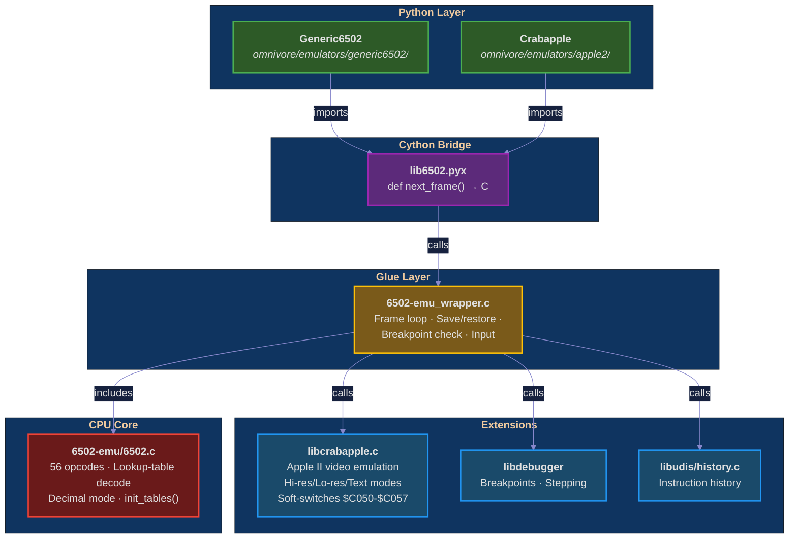

# lib6502 — 6502 CPU emulator for Omnivore

C emulator engine wrapping [David Buchanan's 6502-emu](https://github.com/david-buchanan/6502-emu)
core with Apple II video emulation, debugger support, and Cython bindings
for Python. Powers the `Generic6502` and `Crabapple` emulator classes in
[Omnivore](https://github.com/robmcmullen/omnivore).

## Architecture



## Components

| Component | Description |
|-----------|-------------|
| **6502-emu/6502.c** | 6502 CPU core — 56 NMOS opcodes, lookup-table decode, decimal mode |
| **6502-emu_wrapper.c** | Frame loop, save/restore, breakpoint integration, keyboard input |
| **libcrabapple.c** | Apple II video — hi-res, lo-res, text modes, soft-switches |
| **libdebugger** | Breakpoint and single-stepping support |
| **libudis/history.c** | Instruction execution history recording |
| **lib6502.pyx** | Cython bindings — zero-copy NumPy buffer interface |

## Data flow (one frame)

```
Python: next_frame(input, output, breakpoints, history)
  ↓
wrapper: lib6502_next_frame() — copies keyboard → $C000
  ↓
debugger: libdebugger_calc_frame() → calls step repeatedly
  ↓
wrapper: lib6502_step_cpu() — decode opcode, execute, check breakpoints
  ↓
CPU: 6502.c instruction handler — modifies A,X,Y,PC,SP,SR,memory
  ↓
video: liba2_copy_video() — translate $2000/$4000 → 40×192 framebuffer
  ↓
Python: output['video'] rendered by Omnivore
```

## License

- `lib6502.pyx`, `6502-emu_wrapper.c`, `libcrabapple.c`: MPL 2.0
- `6502-emu/`: MIT — © 2017 David Buchanan

## Author

Rob McMullen — <feedback@playermissile.com>
